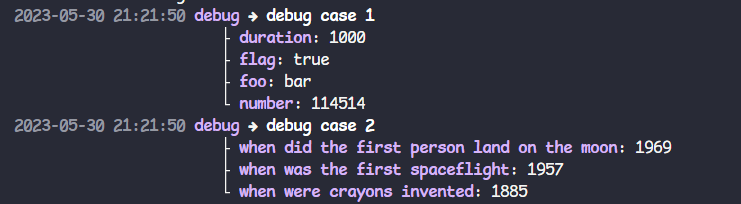
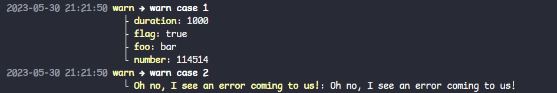
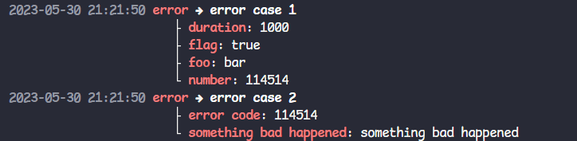

# pzlog

This is a pretty console writer for zerolog, powered by pterm.


## Quick Start

```go
package main

import (
  "github.com/rs/zerolog"
  "github.com/fioepq9/pzlog"
)

func main() {
  log := zerolog.New(pzlog.NewPtermWriter()).
    With().
    TimeStamp().
    Caller().
    Stack().
    Logger()
  
  log.Info().Msg("ok")
}
```

## Screenshot









## Examples

### Change Default Style

```go
package main

import (
  "github.com/rs/zerolog"
  "github.com/fioepq9/pzlog"
)

func main() {
	log := zerolog.New(NewPtermWriter(func(pw *PtermWriter) {
		pw.DefaultKeyStyle = func(key string, l zerolog.Level) *pterm.Style {
			return pterm.NewStyle(pterm.Bold, pterm.FgGray)
		}
	})).With().
		Timestamp().
		Stack().
		Logger()
  
  log.Info().Msg("ok")
}

```